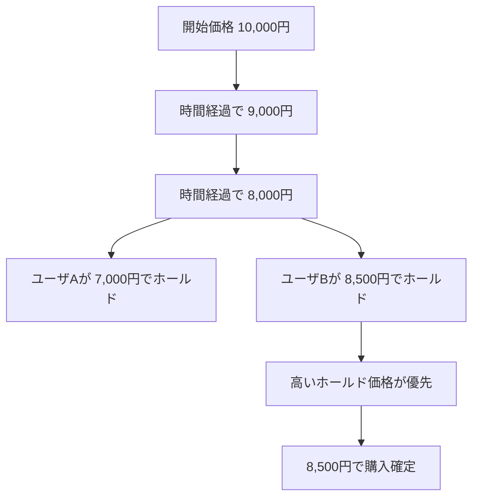
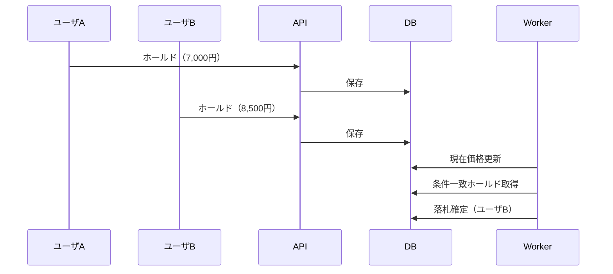

# コレナンボ・オークション

## サービス概要

コレナンボ・オークションは、時間経過により価格が下がるオークションサービスです。

出品時に設定された価格から一定時間ごとに価格が減少し、購入者は現在価格で即時購入するか、希望価格でホールド（予約入札）を行うことができます。

本サービスの特徴は、ホールド機能により複数ユーザの購入意思が競合することで、結果として価格が上昇方向に作用するケースがある点です。

この「下がる価格」と「競合による上昇」のバランスが、従来のECとは異なる価値を生み出します。

---

## 価格変動とホールドのイメージ

---

## ホールド競合時のシーケンス

---

## 主な機能

- 時間経過による価格の自動減少
- 現在価格での即時購入
- ホールド（予約入札）
- 自動購入
- メール認証

---

## 技術的な特徴

本サービスでは以下のような設計課題を扱っています。

- 同時購入・同時ホールド時の競合制御
- 二重購入防止（冪等性）
- トランザクション設計
- 状態変化の管理
- Outbox Pattern によるメール送信

---

## セキュリティ

- トークンのハッシュ保存
- メール存在隠蔽
- レート制限
- ログの安全管理

---

## 技術スタック

- Backend: Go / Gin
- Frontend: React (Vite)
- DB: PostgreSQL + PGroonga
- Cache: Redis
- Infra: Docker / Docker Compose

---
## 開発環境

本プロジェクトは Docker を利用した開発環境で動作します。

セットアップ手順は以下を参照してください。

- [開発者向けセットアップ](docs/development.md)

---

## ステータス

開発中

- 仮登録機能：実装済み
- メール送信：実装済み
- オークション本体：設計中
- 決済：未実装

---

## 今後の予定

- オークションロジック実装
- 決済機能
- 不正対策
- 監査ログ
