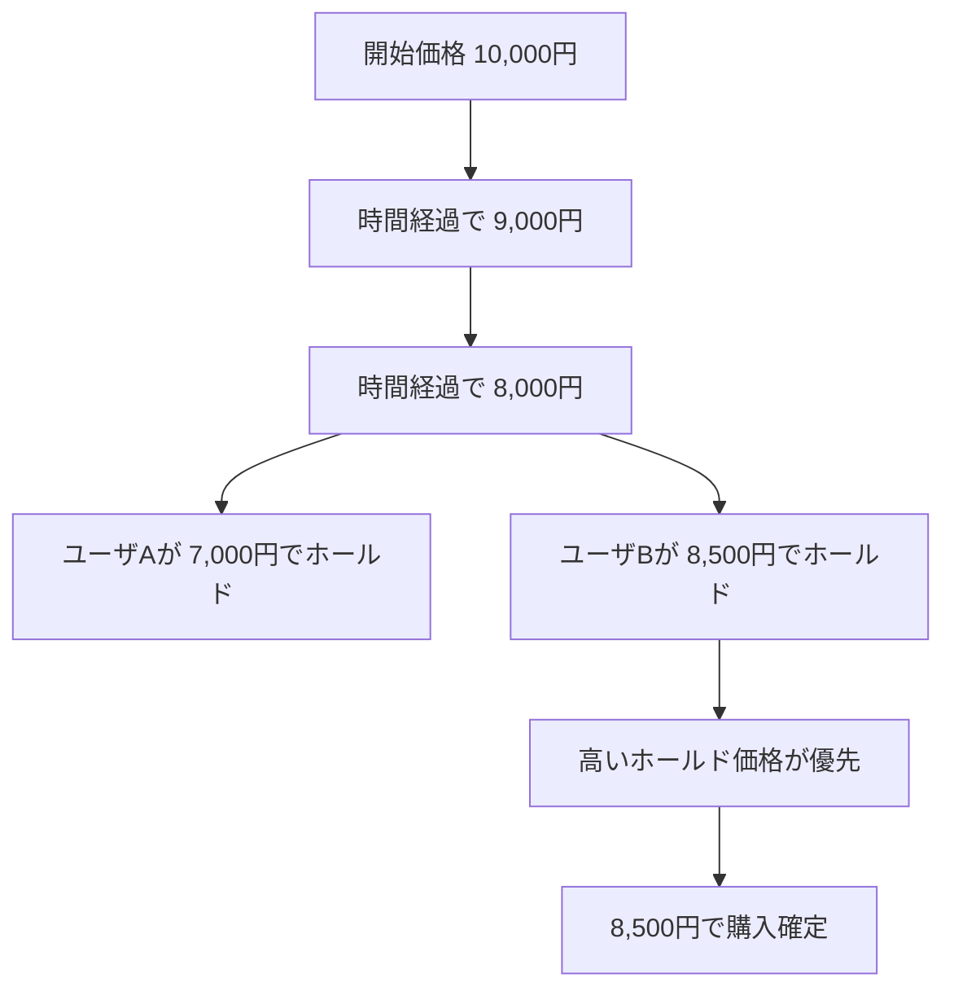
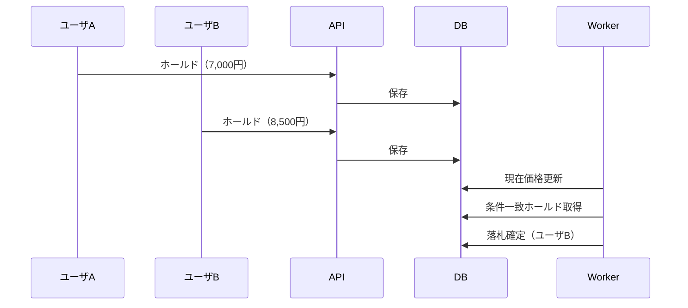

# コレナンボ・オークション

## サービス概要

コレナンボ・オークションは、時間経過により価格が下がるオークションサービスです。

出品時に設定された価格から一定時間ごとに価格が減少し、購入者は現在価格で即時購入するか、希望価格でホールド（予約入札）を行うことができます。

本サービスの特徴は、ホールド機能により複数ユーザの購入意思が競合することで、結果として価格が上昇方向に作用するケースがある点です。

この「下がる価格」と「競合による上昇」のバランスが、従来のECとは異なる価値を生み出します。

設計判断の詳細を先に確認したい場合は、[ドキュメント索引](docs/index.md) の「最初に読むべき docs」から読むのがおすすめです。

---

## 価格変動とホールドのイメージ

---

## ホールド競合時のシーケンス

---

## 主な機能

- 時間経過による価格の自動減少
- 現在価格での即時購入
- ホールド（予約入札）
- 自動購入
- メール認証

---

## 設計上の見どころ

会員登録フローひとつをとっても、以下のような設計判断が含まれています。

### トークンを平文で保存しない

確認メールに含める本登録トークンは、`user_registration_requests` には SHA-256 ハッシュ値のみ保存します。
このテーブルが漏洩しても、本登録 URL や生トークンは復元できません。
ただし送信前・送信中は `mail_outboxes.payload` に平文 URL が一時的に入ります。
送信後は `payload = '{}'` で上書きし、平文 URL をDBから削除します（payload clear）。

### Outbox Pattern によるメール送信

SMTP をトランザクション外で直送すると、「DB にレコードはあるがメールが届かない」状態が起きます。
どのレコードが未送信かを後から特定する手段がなく、手動再送も困難です。

Outbox Pattern では、仮登録レコードの挿入と送信ジョブの挿入を同一トランザクションにまとめます。
「仮登録が成功した = 送信ジョブも存在する」が保証され、SMTP 障害は worker の再試行で吸収できます。

### リトライの分類と stuck recovery

SMTP 接続エラーとテンプレートの parse 失敗を同じ処理にすると問題が起きます。
前者は数分後に回復しますが、後者は何度再試行しても成功しません。

失敗を 4 種類に分類し、それぞれ異なる遷移を取ります。
また、worker が SMTP 送信成功後にクラッシュすると `status='processing'` のまま永続するレコード（stuck mail）が残ります。
15 分後に自動でリカバリし、再送されるよう設計しています。

### at-least-once delivery と冪等性

SMTP プロトコルには「送信済みか確認する」機能がありません。
worker が SMTP 成功後・DB 書き込み前にクラッシュすると、同じメールが再送される可能性があります。
確認メールの重複は設計上明示的に許容しています（同じメールが 2 通届いても機能的な障害にはならない）。

一方、本登録（ユーザ作成）は `FOR UPDATE` + `verified_at` チェック + `user_emails` UNIQUE 制約の 3 層で二重作成を防止します。

### Docker isolated E2E

E2E テストは専用の Docker Compose プロジェクトで実行します。
dev 環境が起動中でも停止中でも実行でき、ホストのポート競合が起きません。
テスト終了後はボリュームごと削除するため、テストデータは蓄積しません。
Playwright から Mailpit REST API をポーリングしてメール到着を確認します。

### Quality Gate

`make fmt` / `make lint` / `make test-cover`（カバレッジ 100%）/ `make frontend-lint` / `make frontend-test` / `make frontend-typecheck` / `make e2e` が全通過することを完了条件とします。

---

## ドキュメント

設計の背景・判断の根拠は docs に記録しています。

- [ドキュメント索引](docs/index.md)

### 設計を深く読みたい方へ（おすすめ読書順）

1. [Outbox Pattern 採用理由](docs/architecture/outbox_pattern_decision.md) — なぜ SMTP 直送を避けたか
2. [リトライ戦略](docs/architecture/retry_strategy_decision.md) — 失敗の分類と stuck mail 対策
3. [at-least-once delivery と冪等性](docs/architecture/at_least_once_and_idempotency.md) — exactly-once を諦めた理由
4. [セキュリティ・性能設計](docs/user_registration/security_and_performance.md) — 19 項目の実装レベル対策

---

## 技術スタック

- Backend: Go / Gin
- Frontend: React (Vite)
- DB: PostgreSQL + PGroonga
- Cache: Redis
- Infra: Docker / Docker Compose

---
## 開発環境

本プロジェクトは Docker を利用した開発環境で動作します。

セットアップ手順は以下を参照してください。

- [開発者向けセットアップ](docs/development.md)

---

## ステータス

開発中

- 仮登録機能：実装済み
- メール送信：実装済み
- オークション本体：設計中
- 決済：未実装

---

## 今後の予定

- オークションロジック実装
- 決済機能
- 不正対策
- 監査ログ
